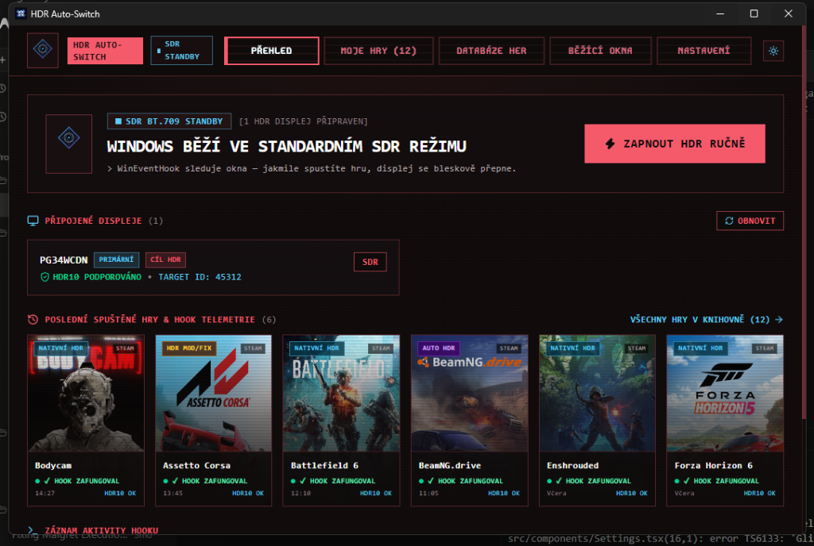

# 🎮 HDR Auto-Switch for Windows

<div align="center">



**Automatic, zero-overhead HDR display switcher for Windows 10 and 11.**  
*No more manual `Win + Alt + B` or monitor blackouts before and after every gaming session.*

[](https://github.com/Soptik1290/hdr-autoswitch/releases/tag/v1.0.5)
[](https://github.com/Soptik1290/hdr-autoswitch)
[](https://v2.tauri.app/)
[](https://www.rust-lang.org/)
[](https://react.dev/)
[](LICENSE)

[**Download Latest Release (.exe Installer)**](https://github.com/Soptik1290/hdr-autoswitch/releases/latest) • [**Release Notes**](RELEASE_NOTES_v1.0.5.md) • [**Report Bug**](https://github.com/Soptik1290/hdr-autoswitch/issues)


</div>

---

## ⚡ Why HDR Auto-Switch?

Windows HDR looks breathtaking in games and movies, but running desktop apps and web browsers in constant HDR often causes washed-out SDR colors, unnecessary power draw, and panel wear on OLED monitors.

**HDR Auto-Switch** runs quietly in your system tray and monitors window focus using native Windows OS events. The moment you launch or switch into an HDR-enabled game, your monitor instantly engages HDR10 / Rec.2020. When you close the game or return to your desktop, it gracefully switches back to SDR BT.709.

---

## ✨ Key Features

### ⚡ 1. True 0.0% CPU Overhead (No Polling)
Unlike conventional tools that continuously poll running processes in background loops (`while True` or `setInterval`), HDR Auto-Switch registers a zero-overhead OS event hook (`SetWinEventHook` with `EVENT_SYSTEM_FOREGROUND`). Your CPU remains 100% asleep until a window focus event actually occurs.

### 🔍 2. Automated Multi-Drive Game Scanner
* **Deep Multi-Drive Discovery**: Automatically scans all connected storage drives (`C:`, `D:`, `E:`, etc.) via Steam's `libraryfolders.vdf` and `appmanifest_*.acf` manifests, Epic Games Launcher manifests (`%ProgramData%\Epic`), GOG Galaxy, and Windows Registry.
* **Modern Shipping Binary Resolution**: Traverses directory structures in under **2.5 seconds** to locate actual Unreal Engine 5 & Northlight executables (e.g. `Binaries/Win64/*-Shipping.exe`) while ignoring asset and content folders.
* **Categorized & Pre-Selected Results**:
  - **HDR Supported Games (Top)**: Verified HDR titles are grouped at the top and pre-selected (`[x]`) by default.
  - **SDR Installed Games (Bottom)**: Other installed games are listed in a separate section below (`[ ]` un-checked by default), allowing you to enable tracking for RTX HDR or community mods with one click.
* **Smart Library State Badges**:
  - `★ NEW`: Newly discovered HDR games ready to be added.
  - `✓ IN LIBRARY`: Previously tracked games that are already up to date.
  - `⚡ UPDATE PATH`: Automatically detects when a game has moved to another drive or folder and updates its path.

### 📂 3. Native File Picker ("Browse...") & Drag & Drop
* **Native Windows File Picker**: Click **"Browse... / Procházet..."** in the Manual Add modal to select any `.exe` using the standard Windows 64-bit file dialog.
* **Global Drag & Drop**: Drag any `.exe` file from Windows Explorer directly into the application window. The app automatically inspects the binary, queries the database, and pre-fills the title and HDR support tier.

### 🛡️ 4. Flexible HDR Deactivation Policies
* **Only when game exits (Recommended)**: Keeps HDR active during Alt+Tab (e.g. checking Discord, Spotify, or a walkthrough in your browser). Completely eliminates monitor renegotiation blackouts, signal delay, and DirectX swapchain desync. Switches back to SDR immediately when the game closes.
* **Deactivate on Alt+Tab (with Debounce)**: Reverts to SDR when leaving the game window after a configurable delay (0 to 10 seconds).

### 📚 5. Multi-Source Verified Database (Steam Curator, HDR Gamer, PCGamingWiki)
* **Direct Steam AppID Pairing**: Pre-linked with **347+ official Steam AppIDs** (from Steam Curator *HDR Games*) for instant, 100% accurate game identification without guessing folder or binary names.
* Comprehensive catalog of **1,027+ verified PC titles** including Native HDR (*Silent Hill 2, Alan Wake 2 & Remastered, Resident Evil 2/3/4/7/Village, Cyberpunk 2077, Black Myth: Wukong, Borderlands GOTY Enhanced, Baldur's Gate 3, Ghostrunner 1 & 2, Mass Effect Legendary Edition*), Windows Auto HDR, and HDR Gamer calibration profiles.
* Built-in 1-click online synchronization with PCGamingWiki API and GitHub master database.


### 💽 6. Drive Migration & Disk Path Verification
* Real-time path checking detects if an executable has been moved across drives or uninstalled, marking it with a `[FILE NOT FOUND]` badge and prompting you to run the scanner to refresh the location.
* Importing moved games automatically updates paths, launchers, and Steam IDs without creating duplicates.

### 🖥️ 7. Native Win32 DisplayConfig API & Per-Monitor Targeting
* Interacts directly with GPU display drivers via native Windows `QueryDisplayConfig` / `SetDisplayConfig` APIs.
* Operates independently of Xbox Game Bar, without simulated keyboard shortcuts or an unscoped keyboard fallback.
* Choose all connected HDR displays or a specific display. The selection uses the Windows device-interface path, not an adapter address that changes after a reboot.
* A disconnected, ambiguous, or unidentifiable selected display stays selected and unavailable. The app never substitutes another display or silently changes the selection to All.

### 🌐 8. Bilingual Interface & System Tray
* Automatically detects system language: launches in **Czech** for Czech/Slovak systems and **English** for all others, with an instant 1-click header toggle (`CZ` / `EN`).
* Silent autostart on Windows boot and minimization to system tray with zero memory footprint.
* Spacious, modern **1280 × 720** cyberpunk UI with monospace typography (`Kode Mono`) and optional GSAP CRT scanlines.

---

## 📦 Installation & Download

### Option 1: Pre-built Windows Installer (Recommended)
Download the latest installer (`.exe` setup or `.msi`) from the [**Releases Page**](https://github.com/Soptik1290/hdr-autoswitch/releases/latest).

1. Run `HDR Auto-Switch_1.0.4_x64-setup.exe`.
2. Follow the installer instructions (creates desktop and start menu shortcuts).
3. The app will detect your connected displays automatically.
4. Click **"Scan PC for Games"** on the My Games tab to populate your library.

### Monitor selection, settings migration, and recovery

Settings are now machine-local. The directory is resolved using Tauri's
`app_local_data_dir`; on a standard Windows profile the file is
`%LOCALAPPDATA%\com.soptik.hdr-autoswitch\config-v2.json`. Settings shows the actual
resolved path. Updates using the same application identifier use this location.
The `controller.lock` file protects the running controller across schema versions;
its presence alone does not mean another instance is running.

On first launch after upgrading, explicitly **Import older settings** from
`%APPDATA%\HDRAutoSwitch\config.json`. The original file is left untouched.
Your game library and preferences are retained, but a previously selected
individual monitor must be selected again because the old runtime ID was not
persistent. An imported **Shortcut** preference pauses automatic switching until
you explicitly enable **Native HDR control**. There is no automatic keyboard
fallback: a native error is reported without toggling other displays.

Display identity is stable for the same Windows device instance/connection. Moving
a cable to another port, replacing a GPU, or reinstalling a driver can require
selecting the monitor again. Friendly names are labels, not identity matches.
Target edits apply to the next game activation; an active session retains its
original target and All retains its original membership.

Primary-monitor labels use the Windows GDI primary-source metadata, not display-path ordering. Cloned targets sharing a primary source share its label. Missing or failed primary metadata is logged and omits the label without invalidating monitor identity or HDR state; HDR control still resolves only by durable monitor identity.

Saves use a flushed, validated staging file, preserved checkpoints, and Windows
file replacement. Failed or uncertain saves are reported, not presented as
**Saved**. Unreadable files and unresolved transaction artifacts pause automation
and expose recovery choices instead of silently writing defaults. **Restore**
and the explicitly confirmed **Reset** preserve original evidence and start a
new settings history. A future schema is read-only and cannot be downgraded with
these controls. Close the app before editing its files; live external edits are
unsupported.

Persisted schema-2 settings, app rows, and monitor targets use strict typed decoding at every document and journal-candidate entry point. All canonical fields must be present, including nullable metadata and journal install sources (explicit `null` remains valid); unknown nested fields are rejected without rewriting the evidence or advertising malformed recovery sources. Legacy import alone retains its recognized defaults, aliases, and permissive compatibility behavior.

A registered recovery source that changes or becomes unreadable retires the
current settings context and blocks automatic authority before recovery inventory
is refreshed. Malformed, unknown, or expired candidate IDs are rejected without
changing authority.

Background library updates and recovery-state changes notify the controller
without waiting for a foreground-window change.

Manual native **On**/**Off** explicitly targets one display or **All**. These
actions remain available during first-run, recovery, unsupported settings, and
pending automatic Native consent; they neither save settings nor grant that
consent. No untrusted default All selection is presented as a saved target.
Controller conflicts, shutdown, or unreadable control authority block manual
actions, and every request still validates native display identity and HDR state.
Automatic activation requires ready settings, Native consent, and an eligible
game; cleanup of changes already owned by the app is a separate operation.

Ruční nativní **Zapnout**/**Vypnout** platí jen pro výslovně zvolený displej nebo
**Vše**, i při pozastavené automatizaci během prvního spuštění, obnovy,
nepodporovaného nastavení nebo čekání na souhlas s automatickým nativním HDR.
Nemění nastavení ani tento souhlas. Konflikt ovladače, ukončování a nedostupná
autorita ovládání ruční zásahy blokují; identita a stav displeje se vždy ověřují.
Automatické HDR nadále vyžaduje platné nastavení, souhlas a způsobilou hru.

Automatic cleanup only reverses changes the app verified that it made. It leaves
pre-existing HDR and observed manual/external overrides alone. An unverified
native result remains unresolved until an explicit, verified per-display (or All)
**On**/**Off** action, including an already-satisfied request. Refresh does not
grant ownership, and a disconnected cleanup is not queued for reconnection.
There is no crash-time HDR restoration journal.

Before upgrading, use **Quit** in the old application's tray menu; closing its
window only hides it. The new startup guard and installer handoff check the
identified installed predecessor and owned startup registrations rather than
killing every process named `tauri-app.exe`. An unresolved conflict pauses all
HDR writes. After quitting the predecessor, use **Recheck HDR controller**.
Launching a legacy portable controller later alongside the new app is unsupported.

Upgrade with the **same installer format and installation directory** as the
existing installation. Cross-format migration, SYSTEM installs, and elevation
using another account are deliberately refused. Autostart requires a registered
installation; portable/development copies cannot register themselves. Existing
Windows Startup Apps disable choices are preserved rather than overridden.

The NSIS uninstaller checks every bundled-file deletion and verifies absence before removing shortcuts or installation ownership. Failure can leave some resources removed and startup disabled; it preserves registration and restores missing cleanup executables without overwriting existing files. Recovery copies remain in the reported temporary recovery directory if a retry or manual repair is needed. Automatic restoration stages a complete copy in an exclusively created directory under the installation before a same-volume, no-overwrite rename. This works with an E: installation and C: temporary backups, and copy failures cannot leave a partial registered executable. Only empty, owned staging directories are removed automatically. If access or locks block restoration, restore only missing original executable paths from the complete recovery copies (not `.restore` staging files) before retrying the registered uninstaller normally (without NSIS `_?=`); an in-place reinstall cannot bypass missing ownership paths. Keep the reported recovery/staging directories until cleanup succeeds, then remove those scoped directories. Unrelated files and user settings are never recursively removed.

---

## 🛠️ Tech Stack & Architecture

| Layer | Technology | Details |
|---|---|---|
| **Runtime** | [Tauri v2](https://v2.tauri.app/) | Lightweight native desktop framework with zero-webview memory mode |
| **Backend** | Rust 2021 | `windows-rs` (Win32 DisplayConfig & WinEventHook), `rfd` (Native dialogs), `reqwest` |
| **Frontend** | React 19, TypeScript | Strict type checking, Vite 8, Tailwind CSS v4 |
| **Animation** | GSAP | SVG displacement filters, text scramble, and CRT scanlines |
| **Icons & Typography** | Lucide React & `Kode Mono` | High-contrast cyberpunk aesthetic |

---

## 💻 Developer Quickstart

### Prerequisites
* [Node.js](https://nodejs.org/) (v22.18+ or v24 LTS, including native TypeScript support for tests)
* [Rust](https://www.rust-lang.org/) (stable toolchain)
* Windows 10 (build 19041+) or Windows 11 with an HDR-capable display

### Development Mode
```bash
# Clone the repository
git clone https://github.com/Soptik1290/hdr-autoswitch.git
cd hdr-autoswitch

# Install dependencies
npm install

# Launch in live dev mode with hot reload
npm run tauri dev
```

### Production Build
To compile the release binaries and generate Windows NSIS and MSI installers:
```bash
npm run tauri build
```
Output files will be generated in:
- `src-tauri/target/release/bundle/nsis/HDR Auto-Switch_1.0.4_x64-setup.exe`
- `src-tauri/target/release/bundle/msi/HDR Auto-Switch_1.0.4_x64_en-US.msi`

### Checks without changing real HDR or installed settings

```powershell
npm ci
npm run build
npm test
cargo test --manifest-path .\src-tauri\Cargo.toml --lib
```

Rust tests use temporary settings directories and mocked display operations.
The Node tests cover mutation ordering/history fences and mixed, unavailable,
and deferred HDR scope rendering.

Run the isolated NSIS source/model regressions with `node --test .\scripts\test-nsis-uninstall.mjs`. These checks simulate sharing locks, missing files, readback failures, and recovery without executing an installer or touching Windows metadata. Template compilation and disposable-VM uninstall/upgrade qualification remain separate release gates.

For browser-only UI checks, run `npm run dev` and open
`http://localhost:1420/tests/ui-fixture.html`. This uses Tauri's IPC mocks and
synthetic settings/displays, not the native application. The fixture accepts
`?mode=first_run`, `?mode=import_available`, `?mode=recovery_required`,
`?mode=unsupported_schema`, and `?failSave=1`. It is not included in the production
bundle. `?mixed=1` exercises an All scope containing both HDR and SDR displays.

These checks do not certify real-monitor reboot/hotplug behavior, power-loss
durability, or NSIS/MSI upgrades of installed older releases. Those scenarios need
separate Windows VM/hardware release validation. The display query and setter
remain separate Windows operations, so native topology changes cannot be made
fully atomic by the application.

---

## 📄 License

Distributed under the [MIT License](LICENSE).  
Developed with ❤️ for the PC and OLED gaming community.
